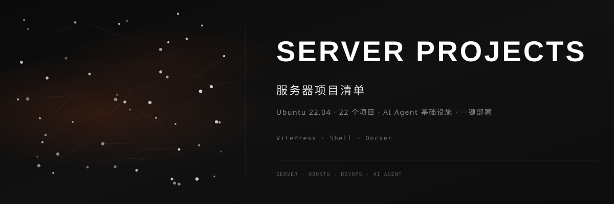

 

### 🖥️ 服务器项目清单

---

## ✨ 功能特性

| 功能 | 描述 |
|------|------|
| 📋 **项目清单** | 23 个项目的完整技术栈和状态总览 |
| 🔧 **部署指南** | 每个项目的安装、配置、运维文档 |
| 📊 **架构总览** | 服务器整体架构和项目间关系图 |
| 📈 **运行监控** | 实时查看各项目运行状态 |
| 📖 **开发指南** | 本地开发环境搭建与文档编写规范 |
| 📜 **变更日志** | 项目重要变更记录 |

## 📖 在线文档

**📚 [点击访问在线文档](https://dirjaker.github.io/server-projects/)**

## 🟢 运行中的服务（4个）

| 服务 | 端口 | 协议 | 本地地址 |
|------|:----:|------|----------|
| **Portfolio** | 10000 | HTTP | http://192.168.31.100:10000 |
| **Vestio** | 10001 | HTTP | http://192.168.31.100:10001 |
| **knowledge_graph** | 10002 | HTTP | http://192.168.31.100:10002 |
| **YOLO Trainer** | 10003 | HTTP | http://192.168.31.100:10003 |

> 所有服务均为前后端合并部署（单端口），FastAPI 直接托管 Vue3 前端静态文件。

## 📚 VitePress 文档（6个）

| 项目 | 功能 | 在线文档 |
|------|------|----------|
| **ai-for-textile-procurement** | 纺织采购 AI 学习指南 | [访问](https://dirjaker.github.io/ai-for-textile-procurement/) |
| **llm_agent_interview** | LLM & Agent 面试题全集 | [访问](https://dirjaker.github.io/llm_agent_interview/) |
| **hermes-skill-guide** | Hermes Skill 开发指南 | [访问](https://dirjaker.github.io/hermes-skill-guide/) |
| **docker_learning** | Docker & K8s 学习笔记 | [访问](https://dirjaker.github.io/docker_learning/) |
| **langchain_learning** | LangChain + LangGraph 学习 | [访问](https://dirjaker.github.io/langchain_learning/) |
| **server-projects** | 服务器项目清单（本项目） | [访问](https://dirjaker.github.io/server-projects/) |

## 💻 应用项目（17个）

| 项目 | 功能 | 技术栈 |
|------|------|--------|
| **vestio** | 智慧衣橱系统 | Vue3 + FastAPI + PyTorch |
| **yolo-trainer** | YOLO 模型训练平台 | Vue3 + FastAPI + PyTorch |
| **portfolio** | 个人作品集网站 | FastAPI + SQLite + Jinja2 |
| **agent_platform** | Agent 工具调用平台 | FastAPI + Pydantic |
| **agent_evaluator** | Agent 评估框架 | FastAPI + Pydantic |
| **agent_guardrails** | Agent 安全防护 | FastAPI + Pydantic |
| **agent_memory_system** | Agent 记忆系统 | FastAPI + SQLAlchemy |
| **multi_agent_crew** | 多智能体协作 | FastAPI + Pydantic |
| **workflow_engine** | 工作流编排引擎 | FastAPI + SQLAlchemy |
| **model-monitor** | 模型 API 监控 | FastAPI + SQLAlchemy |
| **model_deploy** | 模型部署工具 | vLLM + Ollama |
| **api_doc_generator** | API 文档生成器 | FastAPI + Python AST |
| **docker_optimizer** | Docker 镜像优化 | Click + Rich |
| **python_interview** | Python 面试题精讲 | Python + pytest |
| **prompt_engineering** | Prompt 工程平台 | FastAPI + SQLAlchemy |
| **damai_monitor** | 大麦网票务监控 | Playwright + Android |
| **knowledge_graph** | D3.js 可视化知识图谱 | FastAPI + Neo4j + D3.js |

## 🖥️ 服务器环境

| 项目 | 值 |
|------|-----|
| **操作系统** | Ubuntu 22.04 LTS (5.15.0-181-generic) |
| **Python** | 3.12.13 (Miniconda) |
| **内网 IP** | 192.168.31.100 |
| **公共 IP** | 223.167.62.86 |
| **反向代理** | frpc → 101.132.81.140:7000 |
| **端口规划** | 10000-10003（预留 10004-10009 扩展） |

## 📄 许可证

[MIT License](LICENSE)

---

🔗 **GitHub**: [dirjaker/server-projects](https://github.com/dirjaker/server-projects)

⭐ 如果这个项目对你有帮助，请给一个 Star 支持一下！

